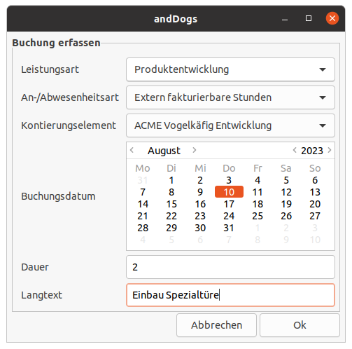

# Timerecording with CATS - andDogs

[](https://www.srb.at)


[](https://www.srb.at/blog--events/)
[](https://github.com/SRBConsultingTeam/)
[](LICENSE)

andDogs is a simple bash script to demonstrate the usage of an OData-API. Therefor the script needs an appropriate backend where the data is posted to, otherwise it will return an error. Don't use the script in productive environments as it is only a proof of concept.

Further details on the script can be found in an upcoming blog post.



## Installation & Usage
The script was designed to run on Ubuntu Linux, but it should run on other distributions too. However, the following description is based on Ubuntu.

First of all install `zenity` which is used to draw the dialog.
```bash
sudo apt-get install zenity 
```

Create the configuration file `conf.json` and adopt the fields to your needs
```json
{
  "LST_ART" : [{ "ID": "ACME_BH", "TEXT": "Consulting" },
               { "ID": "ACME_PH", "TEXT": "Product Development" }],
  "ANAB_ART": [{"ID": "0850", "TEXT": "Internal"},
               {"ID": "0800", "TEXT": "External"} ],
  "PSP" : [{ "ID": "I-ACME/12", "TEXT": "Training of other Coyote" },
           { "ID": "I-ACME/11", "TEXT": "ACME Birdcage Development" } ],
  "SERVICE_ENDPOINT": "https://acme.manufacturing.local/service_endpoint",
  "SERVICE_USER": "Wile.E.Coyote"
}
```

To run the script type:
```bash
./anddogs
```
